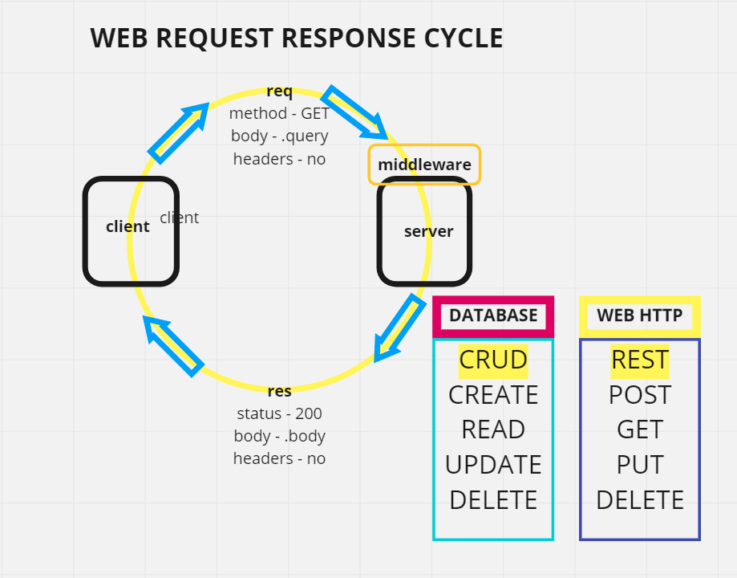

# basic-api-server

basic server to showcase how to break out routes following data modelling for db using class. Also expanding on middleware and tests

## Author: Fizzo Pannosch

**Version**: 1.0.0

<!-- (increment the patch/fix version number if you make more commits past your first submission) -->

### 
 links and resources 

#### 
 [heroku deployed site](https://fizzo-basic-api-server.herokuapp.com/food) 

<!-- #### 
 [github actions](https://github.com/fizzo999/server-deployment-practice/actions) 
 -->

<!-- #### 
 [github pull request](https://github.com/fizzo999/server-deployment-practice/pull/1) 
 -->

#### 
 [ci/cd - github](https://github.com/fizzo999/basic-api-server/runs/2406395315?check_suite_focus=true) 

#### 
 [merged pull request - github](https://github.com/fizzo999/basic-api-server/pull/1) 

## 
 UML DIAGRAM 

## Overview

building a basic express server with node.js. Writing our own tests with supertest and jest.

## Setup

git clone repo from github link:
https://github.com/fizzo999/basic-api-server.git

.env requirements
PORT - Port Number

npm install
(to install dependencies: express, dotenv, supertest, jest)

Running the app
npm start
Endpoint: /clothes for a list of items and /clothes/1 for the 1st item
Endpoint: /food for a list of food items and /food/1 for the 1st food item

Returns Array of Objects in case of GET
Returns success message in case of POST
Returns the updated object in case of PUT
Returns success message in case of DELETE

Tests
Unit Tests: npm run test

## Architecture

node.js based server that uses express library and dotenv package
tests performed with jest and supertest

## Change Log

04-21-2021 7:59pm - Application now has a fully-functional express server, with POST/GET/PUT/DELETE route ('/clothes') and ('/food') endpoints.

## Credits and Collaborations

thank you Nicholas Cerillo for help with part of the delete algorithm of identifying the index of the item to be deleted.

Number and name of feature: setup file structure, write server.js, index,js, 404.js, 500.js, test.js.yml - repo on github and deploy to heroku
Estimate of time needed to complete: 2 hours
Start time: 2:10 pm
Finish time: 4:10 pm
Actual time needed to complete: 2 hours

Number and name of feature: food routes and data model, test suites, bug fix, readme.md, wrrc diagram
Estimate of time needed to complete: 2 hours
Start time: 7:00 pm
Finish time: 8:00 pm
Actual time needed to complete: 1 hours
